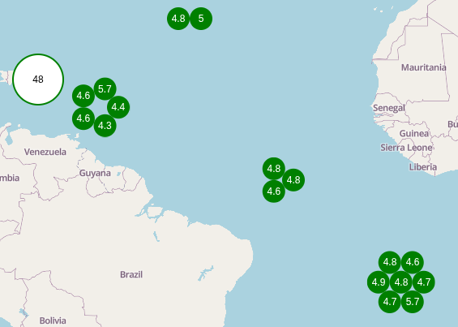
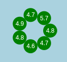
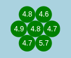
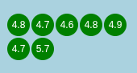

# MapLibre GL Teritorio Cluster

Enhance MapLibre GL JS with fully interactive HTML-based clusters and markers.

**Features:**
- 🧱 Renders MapLibre GL JS clusters as HTML elements.
- 📌 Displays a pinned marker when a feature is clicked.
- 🚫 Unfolded small clusters to avoid requiring zoom or manual ungrouping.

**3 Cluster States:**
- Cluster Marker: A single marker representing a cluster, eg. displaying the number of features.
- Unfolded Cluster: Displays individual features grouped from a small cluster or when at the highest zoom level.
- Unclustered Features

**Customization Callbacks:**
- Custom function to render cluster.
- Custom function to render individual markers.
- Custom function to render unfolded cluster.

---
## Demo

👉 [**Live Demo**](https://teritorio.github.io/maplibre-gl-teritorio-cluster/index.html)


## Installation

Install `@teritorio/maplibre-gl-teritorio-cluster` with yarn

```bash
yarn add @teritorio/maplibre-gl-teritorio-cluster
```

Or use it from CDN
```html
<script type="module" src="https://unpkg.com/@teritorio/maplibre-gl-teritorio-cluster/dist/maplibre-gl-teritorio-cluster.js"></script>
```

## Usage/Examples

> [!WARNING]
> Set your GeoJSON source with `clusterMaxZoom: 22` in order to let the plugin handle individual marker rendering at the highest zoom level.

```javascript
import { buildCss, TeritorioCluster } from '@teritorio/maplibre-gl-teritorio-cluster'
import maplibregl from 'maplibre-gl'
import 'maplibre-gl/dist/maplibre-gl.css'

const map = new maplibregl.Map({
  container: 'map',
  style: {
    version: 8,
    name: 'MapLibre GL Teritorio Cluster',
    sources: {
      points: {
        type: 'geojson',
        cluster: true,
        clusterRadius: 80,
        clusterMaxZoom: 22, // Required
        data: {
          type: 'FeatureCollection',
          features: [
            {
              type: 'Feature',
              properties: { id: 1 },
              geometry: { type: 'Point', coordinates: [0, 0] }
            },
            {
              type: 'Feature',
              properties: { id: 2 },
              geometry: { type: 'Point', coordinates: [0, 1] }
            }
          ]
        }
      }
    },
    glyphs: 'https://orangemug.github.io/font-glyphs/glyphs/{fontstack}/{range}.pbf',
    layers: [],
    id: 'maplibre-gl-teritorio-cluster'
  }
})

// Create whatever HTML element you want as Cluster
function clusterRender(element, props) {
  element.innerHTML = props.point_count.toLocaleString()
  element.style.setProperty('background-color', 'white')
  element.style.setProperty('border-radius', '100%')
  element.style.setProperty('border', '2px solid green')
  element.style.setProperty('justify-content', 'center')
  element.style.setProperty('align-items', 'center')
  element.style.setProperty('display', 'flex')
  element.style.setProperty('color', 'black')
  element.style.setProperty('width', '60px')
  element.style.setProperty('height', '60px')
  element.style.setProperty('cursor', 'pointer')
}

// Create whatever HTML element you want as individual Marker
// You can use buildCss helper as well (exported by @teritorio/maplibre-gl-teritorio-cluster)
function markerRender(element, feature, markerSize) {
  element.innerHTML = props.point_count.toLocaleString()

  buildCss(element, {
    'background-color': 'white',
    'border-radius': '100%',
    'border': '2px solid green',
    'justify-content': 'center',
    'align-items': 'center',
    'display': 'flex',
    'color': 'black',
    'width': `60px`,
    'height': `60px`,
    'cursor': 'pointer'
  })
}

// Create whatever HTML element you want as Pin Marker
function pinMarkerRender(coords, offset) {
  return new maplibregl.Marker({
    scale: 1.3,
    color: '#f44336',
    anchor: 'bottom'
  })
    .setLngLat(coords)
    .setOffset(offset)
}

map.on('load', () => {
  const clusterLayer = new TeritorioCluster(
    'teritorio-cluster-layer',
    'points',
    {
      clusterRender,
      markerRender,
      pinMarkerRender
    }
  )

  // Add the layer to map
  map.addLayer(clusterLayer)

  // Subscribe to feature click event
  clusterLayer.addEventListener('feature-click', (event) => {
    console.log(event.detail.selectedFeature)
  })
})
```

## API Reference

#### Constructor

```js
const clusterLayer = new TeritorioCluster(id, sourceId, options)
```

| Parameter  | Type                               | Description                       |
|------------|------------------------------------|-----------------------------------|
| `id`       | `string`                           | Unique ID for the layer.          |
| `sourceId` | `string`                           | ID of the GeoJSON source.         |
| `options`  | `Partial<TeritorioClusterOptions>` | Optional configuration overrides. |

#### Options

| Option                     | Type                          | Default                      | Description                                                                                         |
|----------------------------|-------------------------------|------------------------------|-----------------------------------------------------------------------------------------------------|
| `clusterMaxZoom`           | `number`                      | `17`                         | Maximum zoom level where clusters are visible.                                                      |
| `clusterMinZoom`           | `number`                      | `0`                          | Minimum zoom level where clustering starts.                                                         |
| `clusterRender`            | `(feature) => HTMLElement`    | `clusterRenderDefault`       | Custom function to render cluster.                                                                  |
| `markerRender`             | `(feature) => HTMLElement`    | `markerRenderDefault`        | Custom function to render individual markers.                                                       |
| `markerSize`               | `number`                      | `24`                         | Pixel size of rendered markers.                                                                     |
| `unfoldedClusterRender`    | `(features) => HTMLElement[]` | `unfoldedClusterRenderSmart` | Custom function to render unfolded cluster.                                                         |
| `unfoldedClusterMaxLeaves` | `number`                      | `7`                          | Maximum number of features to show when a cluster is unfolded.                                      |
| `fitBoundsOptions`         | `mapboxgl.FitBoundsOptions`   | `{ padding: 20 }`            | Options for [fitBounds](https://maplibre.org/maplibre-gl-js/docs/API/classes/Map/#fitbounds) method |
| `initialFeature`           | `GeoJSONFeature \ undefined`  | `undefined`                  | Feature to auto-select on load.                                                                     |
| `pinMarkerRender`          | `(feature) => HTMLElement`    | `pinMarkerRenderDefault`     | Custom renderer for the pinned marker.                                                              |

##### unfoldedClusterRender
The following rendering function are at your disposal:
- `unfoldedClusterRenderSmart` (default): Renders an unfolded cluster in a smart shape (between circle and hexagonal) based on the number of items.

  
- `unfoldedClusterRenderCircle`: Renders an unfolded cluster in a circular shape.

  
- `unfoldedClusterRenderHexaGrid`: Renders an unfolded cluster in a hexagonal grid spiral.

  
- `unfoldedClusterRenderGrid`: Renders an unfolded cluster in a square grid.

  

## Events

```js
clusterLayer.addEventListener('feature-click', (event) => {
  console.info('Selected feature:', event.detail.selectedFeature)
})
```
## Run Locally

Clone the project

```bash
git clone https://github.com/teritorio/maplibre-gl-teritorio-cluster.git
```

Go to the project directory

```bash
cd maplibre-gl-teritorio-cluster
```

Install dependencies

```bash
yarn install
```

Start the server

```bash
yarn dev
```

## Peer Dependencies

This library requires the following peer dependencies to be installed in your project:

- [maplibre-gl-js](https://github.com/maplibre/maplibre-gl-js) >= v5.4.0

## Contributing

Contributions are always welcome!

See [`CONTRIBUTING.md`](CONTRIBUTING.md) for ways to get started.

## Authors

- [Teritorio](https://teritorio.fr)

## License

[MIT](https://choosealicense.com/licenses/mit/)
